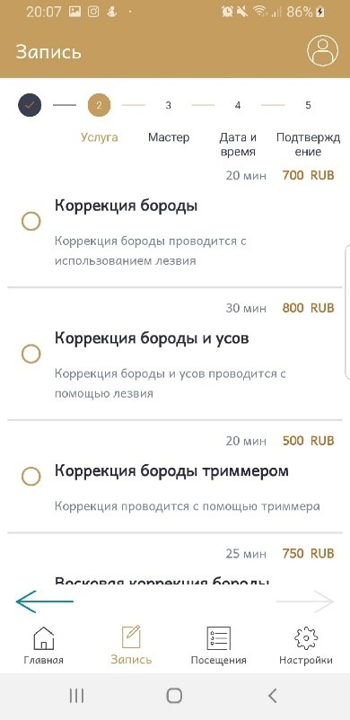

Данная работа выполнена для автоматизации процессов записи в парикмахерскую/барбершоп.
Приложение имеет 3 типа пользователей (клиент, парикмахер и администратор)
Основные возможности каждого типа пользователя:

1) Клиент
  - Выбор типа услуги
  - Выбор парикмахера
  - Выбор даты и времени визита
  - Просмотр рейтинга мастеров
  - Просмотр комментариев и оценок на работы конкретного мастера
  - Редактирование личной информации
  - Загрузка фото в профиль
  - Отмена предстоящего визита
  - Оценивание и комментирование прошедшего визита
  - Просмотр информации о салоне

2) Парикмахер
  - Просмотр отзывов и оценок на свои работы
  - Редактирование личной информации
  - Выбор типов оказываемых услуг
  - Загрузка фотографии в профиль
  
3) Администратор
  - Просмотр рейтинга мастеров
  - Просмотр статистики посещений по каждому дню
  - Просмотр статистики оценок и отзывов по каждому мастеру
  - Редактирование личной информации
  - Загрузка фотографии в профиль
  - Редактирование информации об услугах (смена цены, описания)
  
Авторизация реализована с помощью Firebase Auth
Хранение фотографий пользователей - Firebase Storage
Хранение данных об услугах и информации пользователей - Firebase Cloud Firestore

Ниже представлено несколько примеров разделов пользователя, которые он видит при бронировании посещения салона

Возможность удаления предстоящего посещения

Возможность настройки push-уведомлений и языка

А также несколько примеров интерфейса мастера, работающего в салоне

